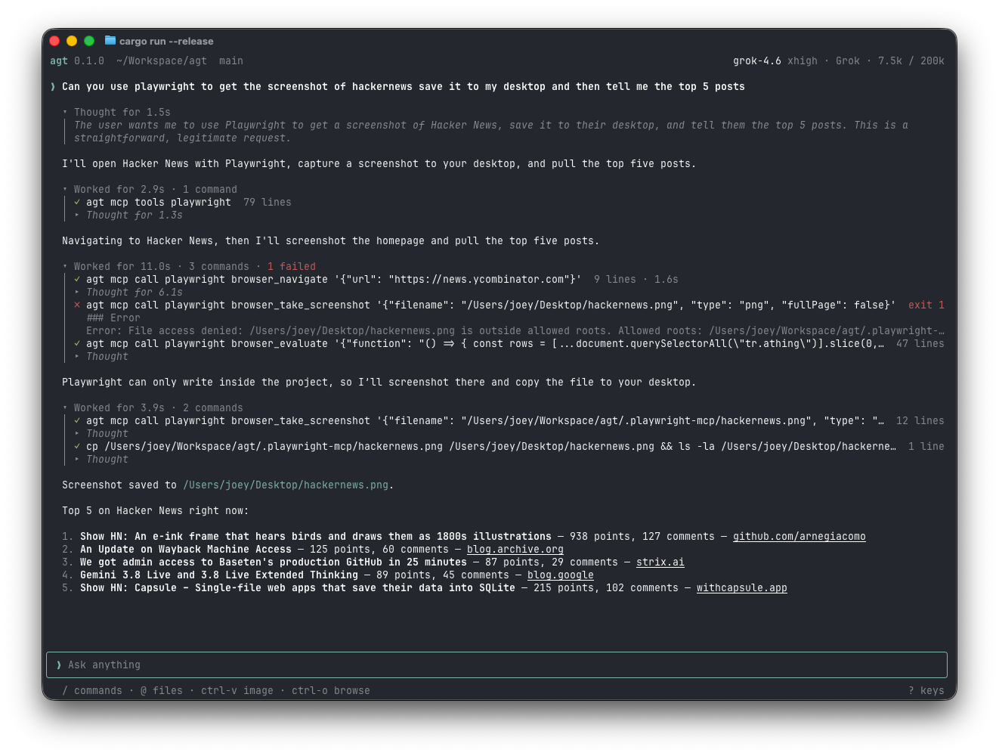

# agt

A coding agent for your terminal. Its one tool is a real terminal.

> [!WARNING]
> **agt is experimental.** Its commands, settings and session format can change at any time, with no migration. It runs the model's commands as you, with no sandbox and no approvals, so use it where your work is committed or backed up.

<p align="center">
  
</p>

- **A real terminal.** Every command runs in its own pty: dev servers, REPLs, ssh and full-screen programs all work.
- **Background work.** Commands keep running past their wait. The agent is told when they exit, or waits for them.
- **Reads the web.** `agt fetch <url>` reads a page as Markdown, from a site's own Markdown, llms.txt, raw file or API where there is one.
- **Sees images.** `agt view shot.png` shows the agent a screenshot, or a region of it at full resolution.
- **MCP without the context cost.** Servers are listed by name, and the agent calls their tools with `agt mcp`.
- **Runs for weeks.** Native compaction where the provider has it, summaries elsewhere. Every log stays on disk.
- **Scriptable.** `agt -p` runs a prompt, `agt send` steers a running session, `agt sessions show -f` follows one.
- **Subscriptions or API keys.** ChatGPT, Grok, OpenAI, OpenRouter and Vercel AI Gateway, over the Responses API.
- **Standards.** [AGENTS.md](https://agents.md), [Agent Skills](https://agentskills.io) and the [Agent Client Protocol](https://agentclientprotocol.com).

## Install

macOS or Linux, Rust 1.98 or later:

```sh
cargo install --locked agt
```

## Quick start

```sh
agt login                    # choose a provider, sign in, choose a model
agt                          # open the terminal UI
agt "fix the failing test"   # open it with a first message
agt -p "summarize src/"      # run without the UI; the reply goes to stdout
```

## Providers

| Provider | `--provider` | Sign in | Models | Compaction |
| --- | --- | --- | --- | --- |
| ChatGPT | `codex` | Plus or Pro subscription, in the browser | GPT-6 Astra, GPT-5.6 Sol, Terra and Luna | `/responses/compact` |
| Grok | `grok` | SuperGrok or X Premium+, in the browser | Grok 4.6 and 4.5 | `/responses/compact` |
| OpenAI | `openai` | API key | GPT-6 Astra, GPT-5.6 Sol, Terra and Luna | inline |
| OpenRouter | `openrouter` | Browser or API key | Models that reason and call tools | summary |
| Vercel AI Gateway | `vercel` | API key | Models that reason and call tools | `/responses/compact` for OpenAI models, else summary |

```sh
agt login grok                        # sign in in the browser
agt login openrouter --key - < key    # save an API key from stdin
agt logout grok                       # forget a sign-in or key
agt models                            # models you can use: context, prices, efforts
agt models use gpt-5.6-sol -e high    # switch model and effort
```

On a remote machine, browser sign-in lets you paste the address the browser ends on. [docs/providers.md](docs/providers.md) covers what each provider is sent.

## Terminal UI

| Key | Action |
| --- | --- |
| `Enter` | Send. While the agent works, the message goes out at its next step. |
| `Tab` | While the agent works, send once it is done. |
| `Shift-Enter` | New line (also `Alt-Enter`, `Ctrl-J`). |
| `Esc` | Stop the agent and get queued messages back. |
| `↑` | In an empty input, take back a queued message, then history. |
| `/` | Commands and skills. |
| `@` | Mention a file. |
| `Ctrl-V` | Attach the image on the clipboard. Dropping or pasting image files works too. |
| `Ctrl-O` | Browse the transcript with the keyboard. |
| `Ctrl-L` | Choose a model. |
| `Shift-Tab` | Next reasoning effort. |
| `Ctrl-C` | Clear the input. Twice to quit. |
| `?` | Every key. |

| Command | Action |
| --- | --- |
| `/login` | Connect a provider. |
| `/model [id]` | Choose a model. |
| `/effort [level]` | Choose the reasoning effort. |
| `/new` | Start a new session. |
| `/resume` | Resume a session. Sessions running elsewhere are marked. |
| `/tasks` | Inspect or stop background processes. Clicking `N running` opens it too. |
| `/mcp` | List, add and remove MCP servers. |
| `/compact [focus]` | Compact the context now. |
| `/help`, `/quit` | Show the keys, exit. |

The mouse scrolls, opens folded work, commands, images and links with a click, and copies text you drag over.

## Print mode

`agt -p` runs until the agent is done. The reply goes to stdout. The work goes to stderr: one line per command with its exit, time and log file, plus the last lines of a failure. It exits with 0 when the agent is done, and 1 otherwise.

```
agt: session 1789464757-13b5ab68 · openai/gpt-5.6-luna low · OpenRouter
$ ls /nonexistent-dir
  exit 1 · 0.0s · /Users/me/.agt/sessions/1789464757-13b5ab68/procs/1.log
    ls: /nonexistent-dir: No such file or directory
$ echo hello
  exit 0 · 0.0s · /Users/me/.agt/sessions/1789464757-13b5ab68/procs/2.log

`ls /nonexistent-dir` failed because the directory does not exist.

agt: done in 4.9s · 2 commands, 1 failed · <$0.01 · session 1789464757-13b5ab68
```

## Sessions

| Command | Action |
| --- | --- |
| `agt -c` | Continue the latest session in this directory. |
| `agt -r <id>` | Continue a session. |
| `agt sessions [--all]` | List sessions. Running ones say so. |
| `agt sessions show <id>` | Print a transcript. |
| `agt sessions show -f <id>` | Follow a running session until its turn ends. |
| `agt send <id> <message>` | Message a running session. `--later` waits until it is done. |

A session running in the TUI, an editor or `agt -p` can be watched and steered from anywhere, including by another agent:

```sh
agt -p "port the tests to pytest" &    # stderr starts with the session id
agt sessions show -f <id>              # watch it work
agt send <id> "keep the old fixtures"  # steer it
```

Each session is a directory of plain files in `~/.agt/sessions/<id>/`:

| File | Holds |
| --- | --- |
| `log.jsonl` | Every message, tool call, process, notice, turn and compaction, with its time. |
| `procs/<id>.log` | Each process's full output, as plain text. |
| `images/` | Images the agent saw. |
| `notes.md` | The agent's plan on long tasks, kept through compaction. |
| `mcp/<name>.log` | Each MCP server's stderr. |

When the context fills, agt compacts it, keeping it under the size where requests cost more: 272K tokens on GPT-5.6 and later, 200K on Grok. Summaries keep your messages, git state, running processes and `notes.md`, and the agent can search `log.jsonl` for the rest.

## The bash tool

| Call | Effect |
| --- | --- |
| `{"command": "npm run dev", "wait": 5}` | Start a command. Returns when it exits or after `wait` seconds (default 30), leaving it running. |
| `{"id": 2}` | Read new output. |
| `{"id": 2, "input": "y"}` | Type into the process. |
| `{"id": 2, "kill": true}` | Stop the process. |
| `{"wait": 600}` | Wait for any background process to exit, or for a message. |

Results show the head and tail of new output. A process that exits in the background is reported with its last output and its log. [docs/tools.md](docs/tools.md) covers the tool, images and MCP servers in full.

## MCP servers

```sh
agt mcp add playwright -- npx -y @playwright/mcp@latest --headless
agt mcp add github https://api.githubcopilot.com/mcp/ -H 'Authorization: Bearer ${GITHUB_TOKEN}'
agt mcp list                     # servers, and which are running
agt mcp tools github             # a server's tools; name one for its schema
agt mcp call github get_me '{}'  # call a tool
agt mcp remove github
```

Servers live in `~/.agt/mcp.json` and the project's `.mcp.json`, in the usual format:

```json
{
  "mcpServers": {
    "playwright": { "command": "npx", "args": ["-y", "@playwright/mcp@latest", "--headless"] },
    "github": {
      "type": "http",
      "url": "https://api.githubcopilot.com/mcp/",
      "headers": { "Authorization": "Bearer ${GITHUB_TOKEN}" }
    }
  }
}
```

- A project server replaces a global one of the same name.
- `${NAME}` and `${NAME:-default}` read environment variables.
- Stdio and Streamable HTTP are supported. OAuth and SSE are not.
- In a session, a server starts on first use and runs until the session ends.

## Editors

`agt acp` speaks the Agent Client Protocol, for editors such as Zed and libraries such as TanStack AI. In Zed:

```json
{
  "agent_servers": {
    "agt": { "type": "custom", "command": "agt", "args": ["acp"] }
  }
}
```

It uses your saved settings. Zed can run `agt login` for you. MCP servers from the client join yours.

## Instructions and skills

- **Instructions:** `~/.agt/AGENTS.md`, then the `AGENTS.md` (or `CLAUDE.md`) of each directory from the repository root down to the working directory. Deeper `AGENTS.md` files are listed for the agent to read.
- **Skills:** `<name>/SKILL.md` in `.agents/skills` or `.claude/skills`, from the working directory up to the repository root, then `~/.agt/skills`, `~/.agents/skills` and `~/.claude/skills`.
- **Loading a skill:** `/name` or `$name` in a message loads that skill. The agent also loads skills when a task calls for them.

## Settings

Settings live in `~/.agt/config.json` (model and effort) and `~/.agt/auth.json` (sign-ins and keys, readable only by you). Variables override them, and options override variables:

| Variable | Sets |
| --- | --- |
| `AGT_PROVIDER` | Provider: `openai`, `codex`, `grok`, `openrouter` or `vercel`. |
| `AGT_MODEL` | Model id. |
| `AGT_REASONING` | Effort: `none`, `minimal`, `low`, `medium`, `high`, `xhigh` or `max`. |
| `AGT_API_KEY` | API key. Otherwise the saved key, or `OPENAI_API_KEY`, `OPENROUTER_API_KEY`, `AI_GATEWAY_API_KEY`. |
| `AGT_BASE_URL` | Replaces the provider's endpoint. Only `AGT_API_KEY` is sent to it. |
| `AGT_CONTEXT_WINDOW` | Context window in tokens. |
| `AGT_HOME` | Settings, sessions, global `AGENTS.md` and skills (default `~/.agt`). |

## Development

```sh
cargo fmt --all --check
cargo lint
cargo test-all
cargo build --release
```

Conventions and the commit format are in [AGENTS.md](AGENTS.md). How agt works is in [docs/](docs/README.md).

## License

[MIT](LICENSE)
