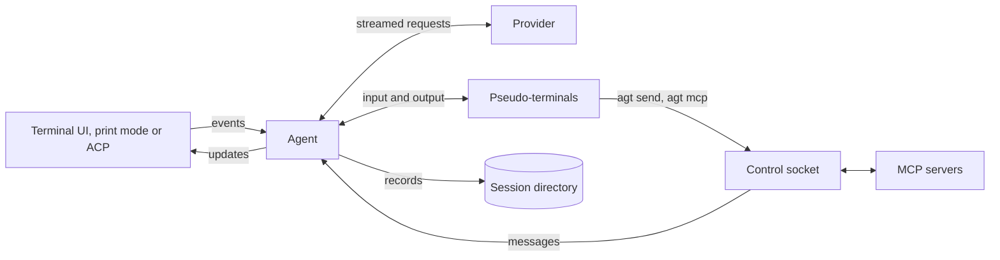

# How agt works

agt is a coding agent for the terminal whose one tool is a real terminal. The
model runs commands in pseudo-terminals and reads what they print, and it reads
web pages with `agt fetch`, sees images with `agt view` and calls MCP servers'
tools with `agt mcp`, all commands it runs through that tool.

One agent core serves three frontends, the terminal UI, print mode and the
Agent Client Protocol, over the Responses API of five providers. Everything a
session does is written to plain files in its directory as it happens.

## The documents

| Document                        | What it explains                                                                       |
| ------------------------------- | -------------------------------------------------------------------------------------- |
| [Architecture](architecture.md) | The event loop, turns, context and compaction, what is stored, and measured numbers    |
| [Providers](providers.md)       | What each provider is sent, how it signs in, compacts and lists models, and adding one |
| [Tools](tools.md)               | The bash tool, web pages through `agt fetch`, images through `agt view`, and MCP servers through `agt mcp` |
| [Interfaces](interfaces.md)     | The commands, print mode's output, the session log, the control socket, and ACP        |
| [Terminal UI](terminal-ui.md)   | How the UI draws, and its transcript, input and menus                                  |

Repository conventions, checks, and the commit format are in
[AGENTS.md](../AGENTS.md).

## The shape of it

The frontend owns a channel and the loop that waits on it. Model streams,
processes and the session's control socket report on threads of their own; the
agent handles each event without blocking and produces updates the frontend
renders. Process output goes to log files and the conversation to `log.jsonl`
as they happen, so a running session can be read, followed and steered from
another process, and resumed after a crash.

## Principles

1. **One tool, a real terminal.** Dev servers, REPLs, ssh and full-screen
   programs work because every command gets a pseudo-terminal. Web pages,
   images and MCP tools are commands too, so the tool list never grows and a
   request is the same size however many servers a session has.
2. **The event loop never blocks.** Requests and processes run on threads that
   report as events, and every wait is a deadline. An idle agent wakes for
   nothing.
3. **Memory follows the context, not the session.** Output lives in log files,
   the conversation in `log.jsonl` and images in `images/`. Only the live
   context and a little state per process stay in memory, so a session can run
   for weeks.
4. **The log is the record.** It is append-only and resumable after a crash at
   any point. A turn stops before its next request or command when a write
   fails, so the log never misses work that happened.
5. **Stay in the cache.** Instructions and tools stay byte-identical, and
   history is only appended to, from one compaction to the next, so each request
   reuses the provider's prompt cache. Facts that change go in messages.
6. **Each provider gets what it documents.** Providers are a closed set, and a
   request carries exactly the fields and headers its provider documents.
7. **Tell the model; don't guard against it.** Errors name the problem and the
   call to make instead, results say what is still running, and notices say what
   happened in the background. agt asks for no approvals and adds no guards
   against misbehavior it only imagines.

## Out of scope

agt does not sandbox or approve commands, offer tools besides bash, speak Chat
Completions or providers' own APIs, keep conversations on a provider's servers,
reach MCP servers over SSE or with OAuth, send telemetry, or run on Windows.
